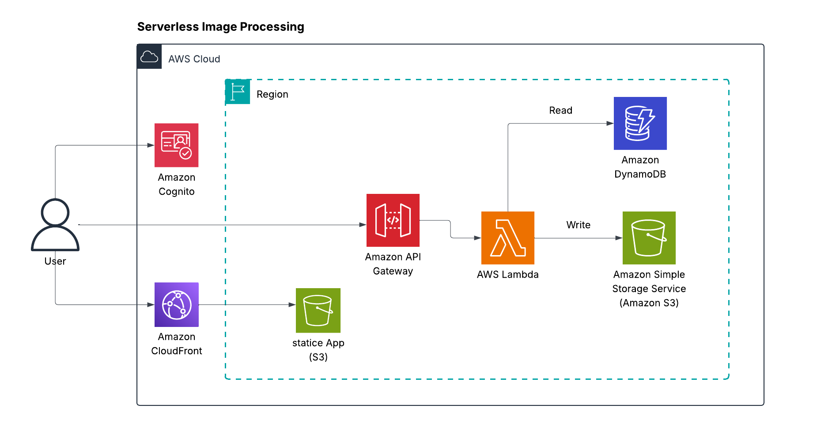

# Serverless-REST-API-with-DynamoDB-and-API-Gateway
## Content:
- [High-level overview of the project](#high-level-overview-of-the-project)
- [Key AWS Services Used](#key-aws-services-used)
- [Some Notes](#some-notes)
- [IAM Roles](#some-notes)
- [Security Considerations](#Security-Considerations)
- [Project Flow](#project-flow)
## High-level overview of the project:

## Key AWS Services Used:
This is an architecture for a Serverless Image Processing on AWS using the following services:  

* **Amazon S3:** Stores original and processed images.  
* **AWS Lambda:** Executes image processing (resize, watermarking).  
* **Amazon API Gateway:**  Expose an API for uploads.  
* **Amazon DynamoDB:** Store metadata about uploaded images.
  
* ## Some Notes
  
* This architecture is cost-effective, highly scalable, and removes the need to manage infrastructure. 
*  You can integrate Amazon Rekognition or other AI services inside Lambda for deeper image analysis.
*  You may configure S3 event triggers to invoke Lambda directly when a file is uploaded to a bucket.
*  ## IAM Roles:

| Service           | IAM Policies Needed                                     |
|-------------------|---------------------------------------------------------|
| API Gateway       | `AmazonAPIGatewayInvokeFullAccess`                      |
| AWS Lambda        | `AWSLambdaBasicExecutionRole`, custom S3/DynamoDB access |
| DynamoDB          | `dynamodb:GetItem`, `dynamodb:Query`                    |
| S3                | `s3:PutObject`, `s3:GetObject`                          |

   ## Security Groups:

| Resource         | Inbound Traffic                 | Outbound Traffic                        |
|------------------|----------------------------------|------------------------------------------|
| API Gateway      | Public Internet (HTTPS)         | AWS Lambda                               |
| Lambda           | From API Gateway                | DynamoDB, S3                             |
| DynamoDB         | From Lambda only                | None                                     |
| S3               | From Lambda only                | Based on bucket policy                   |

## Project Flow:

1. **Step 1** – A user sends an HTTP request (e.g., image upload) via API Gateway.
2. **Step 2** – API Gateway forwards the request to an AWS Lambda function.
3. **Step 3** – The Lambda function reads metadata or configuration from DynamoDB.
4. **Step 4** – The Lambda function processes the image and writes the result to Amazon S3.

