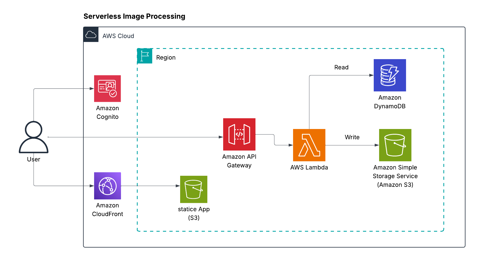

# AWS Architecture Serverless Image Processing with S3 and Lambda
## Content:
- [High-level overview of the project](#high-level-overview-of-the-project)
- [Key AWS Services Used](#key-aws-services-used)
- [Some Notes](#some-notes)
- [IAM Roles](#some-notes)
- [Security Considerations](#Security-Considerations)
- [Project Flow](#project-flow)
## High-level overview of the project:

## Key AWS Services Used:
This is an architecture for a Serverless Image Processing on AWS using the following services:  

* **Amazon S3:** Stores original and processed images.
* **Amazon CloudFront**  CDN for fast content delivery
* **Amazon Cognito** User authentication and token management 
* **AWS Lambda:** Executes image processing (resize, watermarking).  
* **Amazon API Gateway:**  Expose an API for uploads.  
* **Amazon DynamoDB:** Store metadata about uploaded images.
  
* ## Some Notes
  
* This architecture is **cost-effective**
*  **highly scalable**, and eliminates the need to manage infrastructure.
* You can integrate **Amazon Rekognition** or other AI services inside Lambda for deeper image analysis.
* It's possible to configure **S3 event triggers** to invoke Lambda functions directly when files are uploaded.
* The frontend static app (React, Vue, etc.) is hosted in **Amazon S3** and served through **CloudFront**.
* **Cognito** provides secure user authentication and authorization for the API.
  
*  ## IAM Roles:

| Service           | IAM Policies Needed                                     |
|-------------------|---------------------------------------------------------|
| API Gateway       | `AmazonAPIGatewayInvokeFullAccess`                      |
| AWS Lambda        | `AWSLambdaBasicExecutionRole`, custom S3/DynamoDB access |
| DynamoDB          | `dynamodb:GetItem`, `dynamodb:Query`                    |
| S3                | `s3:PutObject`, `s3:GetObject`                          |
| Cognito          | `AmazonCognitoPowerUser` (for identity and token handling) |

   ## Security Groups:

| Resource         | Inbound Traffic                 | Outbound Traffic                        |
|------------------|----------------------------------|------------------------------------------|
| API Gateway      | Public Internet (HTTPS)         | AWS Lambda                               |
| Lambda           | From API Gateway                | DynamoDB, S3                             |
| DynamoDB         | From Lambda only                | None                                     |
| S3               | From Lambda only                | Based on bucket policy                   |

## Project Flow:
1. **Step 1** – The user accesses the static web app hosted on S3 via **Amazon CloudFront**.
2. **Step 2** – The user signs in using **Amazon Cognito** and obtains an auth token.
3. **Step 3** – The user sends an HTTP request (e.g., image upload) via **Amazon API Gateway** with the token.
4. **Step 4** – **API Gateway** forwards the request to an **AWS Lambda** function.
5. **Step 5** – The Lambda function reads configuration or metadata from **DynamoDB**.
6. **Step 6** – The image is processed (e.g., resized, watermarked), then stored in **Amazon S3**.
7. **Step 7** – Metadata is written back to **DynamoDB**, and a response is returned to the user.

